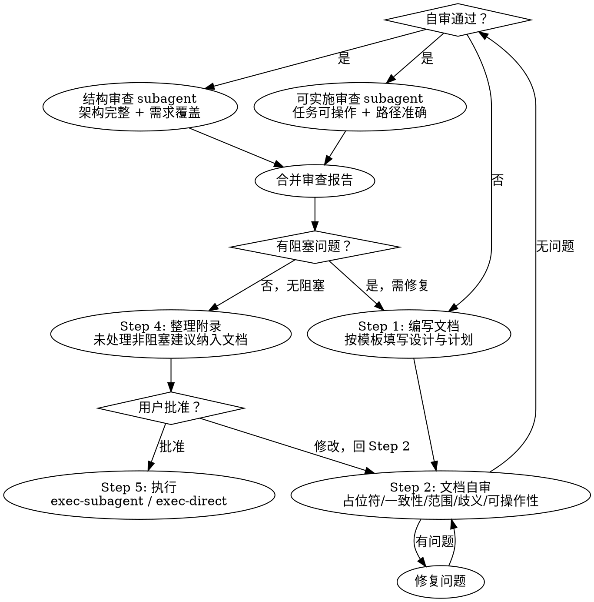

# 蓝图编写

## 概览

将已确认的方案与设计转化为结构化的实施计划文档。包含文档编写、自动审查（结构 + 可实施）、用户审查与执行交接。

**前置条件：** 必须先完成 `brainstorming`（方案确认）。本技能不讨论方案选型或设计细节，且不可跳过 `brainstorming` 直接调用。

## 流程总览



## 工作流程

### Step 1: 编写文档

设计方向确认后，编写一份包含架构设计与实施计划的完整文档。

> **要求：** 蓝图文档仅包含已选定的方案。未采用的替代方案不应出现在文档中。如有必要，可在“为什么是这个方案”部分简要引用其他方案的关键权衡，但不得为未选方案留独立章节。

**保存路径：** `docs/blueprint/YYYY-MM-DD-<功能名>.md`（用户可覆盖此默认路径）

#### 文档模板

```markdown
# [功能名] 设计与实施计划

> **技术栈：** [关键技术/库]

---

## 设计目标

[此功能解决什么问题？核心目标是什么？有哪些约束条件或关键决策？]

---

## 架构设计

### 架构概览

[2–3 句说明整体方案]

### 组件职责

| 组件 | 职责 |
|------|------|
| [组件名] | [做什么] |

### 数据流

[核心数据流转路径说明]

### 接口与边界

[组件间接口定义]

### 错误处理

[关键错误场景及处理策略，如：异常降级、重试机制、日志记录]

### 测试策略

[测试覆盖范围：单元测试层级、集成测试重点、端到端场景]

---

## 实施计划

### 前提条件

[外部依赖、环境准备、配置项、前置迁移等实施前需完成的事项]

### 文件结构

| 文件 | 操作 | 职责 |
|------|------|------|
| `路径/文件` | 创建 | [职责描述] |

### 任务清单

每个任务是**可独立实现、测试、交付的组件或功能单元**（过小的单函数/单文件变更不应单独成任务）。**禁止创建子任务**（如 `Task 1.1`、`Task 1.1.1`）——所有任务平级排列，每个任务都是独立的完整交付单元。

每任务标注复杂度等级：
- **简单** — 1-2 文件、明确规格、机械实施
- **中等** — 多文件协调、集成判断
- **复杂** — 架构决策、调试、跨模块设计

#### Task 1: [组件名] `中等`

**验收标准：**
- [所有测试通过]
- [期望的外部可观察行为]

**文件：**
- 创建：`路径/文件`
- 修改：`路径/文件:行号`
- 测试：`路径/测试文件`

**步骤：**
- [ ] 编写 [组件] 的失败测试
- [ ] 运行测试确认失败
- [ ] 编写最小实现使测试通过
- [ ] 运行测试确认通过
- [ ] 提交

#### Task 2: ...
```

### Step 2: 文档自审

写完文档后，以新视角检查：

| 检查项 | 说明 |
|--------|------|
| 占位符扫描 | 任何“TBD”“TODO”“待补充”？修复 |
| 内部一致性 | 架构描述与任务实现是否对应？前后矛盾？ |
| 范围检查 | 够聚焦于一个计划？还是需要拆分子项目？ |
| 歧义检查 | 任何需求可作两种解读？明确选择其一 |
| 单一方案 | 蓝图仅包含一个选定方案，而非多个方案并列？ |
| 任务可操作 | 每个步骤描述是否足够清晰，执行者知道做什么？ |
| 禁止子任务 | 不存在 `Task 1.1`、`Task 1.1.1` 等嵌套编号？所有任务平级排列 |
| 完整性 | 每个设计点是否都有对应实施任务？ |

发现问题直接修复，无需重新审查。

### Step 3: 外部审查

同时分发两路审查 subagent：

- **蓝图结构审查**（`blueprint-structure-reviewer`）—— 验证架构完整、需求覆盖、单一方案、范围聚焦、无占位符（仅读蓝图文档文本，不查项目文件）
- **蓝图可实施审查**（`blueprint-readiness-reviewer`）—— 验证可执行、任务分解清晰、文件路径适配、步骤可操作（不关心内部结构设计）

两路审查并行运行，结果合并为统一报告。循环审查至**无阻塞问题**（两路均通过）方可结束：

- **阻塞问题（Blocker）** —— 架构缺陷、需求遗漏、方案矛盾、任务不可执行、占位符等导致无法实施的重大问题。阻塞问题必须修复，修复后启动下一轮审查。
- **非阻塞建议（Non-blocker）** —— 风格偏好、可读性优化、次要补充等不影响实施的建议。记录但不强制实施。

每轮审查启动新的 subagent 实例，不携带上一轮修复内容，不复用上一轮会话。subagent 以全新视角审查当前文档。

### Step 4: 整理附录

审查循环结束后，将审查者提出但**决定不处理**的非阻塞建议整理为附录，合并至蓝图文档末尾，每项附简述理由。已采纳或已在修复中覆盖的建议不列入附录。该附录随蓝图文档进入用户审查。

### Step 5: 用户审查与执行

将文档（含附录）提交用户审查，同时请用户选择执行方式：

> 文档已写入 `<路径>`，请审阅。如有修改意见请告知，确认后选择执行方式：
> 1. **`exec-subagent`** —— 每个任务分发独立 subagent，实施完成后并行运行规范审查与质量审查，适合任务独立的场景
> 2. **`exec-direct`** —— 在当前会话中按序执行，设置检查点汇报进展，适合任务耦合度高或无需 subagent 的场景”

等待用户反馈。如有修改，调整后**跳转至 Step 2（文档自审）** 重新检查，通过后再次分发外部审查。用户批准后根据所选执行方式调用对应的执行技能。

## 关键原则

- **YAGNI 严格** —— 从所有设计中剔除不必要功能
- **精确文件路径** —— 每个任务标注确切文件路径
- **步骤可操作** —— 每步描述清楚做什么，不写“同上”“类似 Task N”
- **无占位符** —— 所有步骤包含可执行的内容描述
- **禁止子任务** —— 所有任务平级排列，禁止 `Task 1.1` 等嵌套编号
- **尽早提交** —— 每个任务完成后提交

## 常见错误

| 错误 | 后果 | 修复 |
|------|------|------|
| 跳过 brainstorming 直接调用 | 方案未经确认，蓝图可能偏离需求 | 必须先激活 brainstorming 完成方案确认 |
| 蓝图中含多个替代方案 | 执行者不确定选哪个 | 仅包含已选定方案，未选方案不列独立章节 |
| 创建 Task 1.1 等子任务 | 任务粒度不均，审查和分发困难 | 全部平级排列，每任务是独立交付单元 |
| 文件路径模糊（如 `src/`） | 执行者找不到或创建错文件 | 精确到 `src/features/X.ts` |
| 有阻塞问题仍提交用户审阅 | 用户浪费时间审查不可行的计划 | 循环至无阻塞问题才提交 |

## 快速参考

| 阶段 | 动作 |
|------|------|
| 编写文档 | 按模板写入 `docs/blueprint/YYYY-MM-DD-<功能名>.md` |
| 文档自审 | 检查占位符、一致性、范围、歧义、完整性、单一方案 |
| 外部审查 | 并行结构审查 + 可实施审查，循环至无阻塞 |
| 整理附录 | 将未处理的非阻塞建议纳入文档 |
| 用户审查 | 提交 → 确认 → 按选择执行方式实施 |
