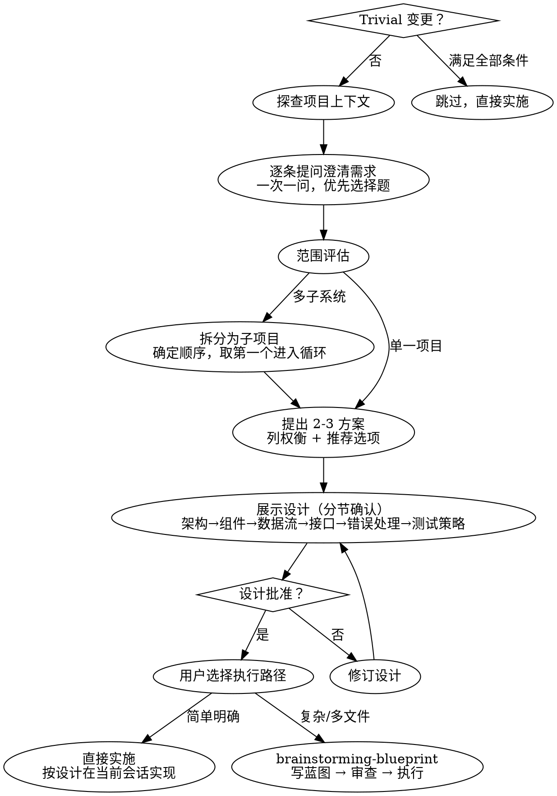

# 方案确认

## 概览

将模糊的需求转化为明确的方案选型与设计。通过逐条提问收敛需求，提出多个方案并推荐，确认选型后分节展示设计细节，由用户逐步确认。

在方案与设计确认并获得用户批准之前，**不得**开始编写蓝图文档或执行任何实施步骤。

<HARD-GATE>
Do NOT proceed to blueprint writing or implementation until the solution AND design have been explicitly confirmed by the user. This applies to EVERY project regardless of perceived simplicity.
</HARD-GATE>

## 反模式：“太简单了不需要设计”

任何非 trivial 的项目都经过此流程。待办清单、单函数工具、配置变更——只要不满足下方 trivial 条件，都需要先明确方案。“简单”项目恰是未经验证的假设造成最多返工的地方。

### Trivial Bypass（微不足道的变更可跳过）

变更满足**全部**以下条件时可跳过本流程，直接实施：

- 改动量 ≤ 5 行
- 仅涉及配置文件的值变更、字符串内容修正、typo 修复
- 不改变函数签名、数据流、接口定义
- 不影响现有行为的正确性

边界模糊时**不准跳过**——走完整流程。

## 流程总览

## 工作流程

### Step 0: 判断是否为 Trivial 变更

是否满足 Trivial Bypass 条件？
- **满足** → 跳过本技能，直接实施（告知用户：“此变更简单，跳过设计流程直接实施”）
- **不满足** → 继续下方流程

### Step 1: 探查项目上下文

检查项目结构、文档和近期提交，了解现有模式和约定。

### Step 2: 逐条提问澄清需求

- 一次只问一个问题
- 优先用选择题而非开放题
- 理解目标、约束、成功标准
- 如需求包含多个独立子系统（如“做一个带聊天、文件存储、计费的分析平台”），先指出需分解，切勿直接进入细节
- 对适当规模的项目，逐步收敛需求

**范围判断：** 若请求涉及多个独立子系统，先帮助用户拆分为子项目，明确各子项目的关系和构建顺序。然后针对第一个子项目走完整流程。每个子项目获得独立的确认→实施循环（复杂子项目经蓝图，简单子项目直接实施）。

### Step 3: 方案探索与选择

- 提出 2–3 个方案，列出各方案的权衡
- 给出推荐方案及理由
- 与用户确认，选定最终方案
- **方案选定后方可进入设计展示**

### Step 4: 展示设计（分节确认）

方案选定后，分节展示设计。每节保持简洁，完成后询问是否合理。

覆盖范围：
- **架构概览** —— 整体方案
- **组件定义与职责** —— 每个组件做什么
- **数据流** —— 核心流转路径
- **接口与边界** —— 组件间交互方式
- **错误处理思路**
- **测试策略**
- 其它有价值内容

设计原则：
- 每个组件只有一个职责，通过定义良好的接口通信
- 组件可独立理解和测试
- 遵循现有代码风格和模式
- 不做无关重构。如现有代码问题影响当前工作，将针对性改进纳入设计

**Design for isolation** —— 每设计一个组件时，回答三个问题：
1. **它做什么？** —— 能否用一句话说清职责，不需要读者了解内部实现？
2. **怎么用它？** —— 外部通过什么接口与之交互，依赖什么？
3. **它依赖什么？** —— 依赖关系是否清晰且最小化？

判断边界是否合理的检验标准：
- 能否在不了解组件内部实现的情况下理解其用途？
- 能否在不影响外部使用者的前提下修改内部实现？
- 如果答案是否定的，说明组件边界有问题，需要重新拆分。

文件大小也是信号：当一个文件变得臃肿，往往意味着它承担了过多职责，应当拆分。

## 进入下一步

方案与设计确认后，向用户展示执行路径选择：

> 方案与设计已确认。此实现 [简单/中等复杂度]，建议：
> 1. **直接实施** —— 改动明确，步骤机械，在当前会话按设计实现
> 2. **`brainstorming-blueprint`（写实施计划）** —— 多文件协调、复杂依赖或需自动审查，先文档化再执行
>
> 你的选择？

## 关键原则

- **一次问一个问题** —— 不堆叠多个问题
- **优先选择题** —— 比开放题更容易回答
- **YAGNI 严格** —— 从所有设计中剔除不必要功能
- **增量确认** —— 先选方案，再分节展示设计逐步确认
- **先确认再实施** —— 方案与设计确认后再编写文档或直接实施

## 快速参考

| 阶段 | 动作 |
|------|------|
| Trivial 判断 | 满足 ≤5 行 + 配置值变更 → 跳过；否则走完整流程 |
| 上下文探查 | 读项目结构、文档、近期提交，了解现有模式 |
| 需求澄清 | 逐条提问，一次一问，优先选择题而非开放题 |
| 方案选择 | 出 2-3 方案 → 列权衡 → 推荐 → 用户确认选定 |
| 设计展示 | 分节确认：架构 → 组件 → 数据流 → 接口 → 错误处理 → 测试 |
| 进入下一步 | 展示二选一：直接实施或 `brainstorming-blueprint`（写实施计划） |
