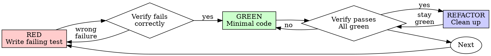

# 测试驱动开发（TDD）

## 概述

先写测试。看它失败。写最简代码让它通过。

**核心原则：** 没看过测试失败，就不知道它测的对不对。

**违反规则的文字就是违反规则的精神。**

## 何时使用

**始终使用：**
- 新功能
- 缺陷修复
- 重构
- 行为变更

**例外（征求搭档同意）：**
- 一次性原型
- 生成代码
- 配置文件

想着“就这一次不写 TDD”？停下。那是合理化借口。

## 铁律

```
无失败测试，不写生产代码
```

先写了代码？删掉。重来。

**没有例外：**
- 不留作“参考”
- 不边写测试边“改编”
- 不看它
- 删除就是删除

从头从测试开始实现。没商量。

## 红-绿-重构



### RED - 写失败测试

写一个最简测试，展示应该发生什么。

<Good>
```typescript
test('retries failed operations 3 times', async () => {
  let attempts = 0;
  const operation = () => {
    attempts++;
    if (attempts < 3) throw new Error('fail');
    return 'success';
  };

  const result = await retryOperation(operation);

  expect(result).toBe('success');
  expect(attempts).toBe(3);
});
```
命名清晰，测真实行为，一件事
</Good>

<Bad>
```typescript
test('retry works', async () => {
  const mock = jest.fn()
    .mockRejectedValueOnce(new Error())
    .mockRejectedValueOnce(new Error())
    .mockResolvedValueOnce('success');
  await retryOperation(mock);
  expect(mock).toHaveBeenCalledTimes(3);
});
```
命名模糊，测的是 mock 不是代码
</Bad>

**要求：**
- 一个行为
- 命名清晰
- 真实代码（除非不可避免，不用 mock）

### 验证 RED - 看它失败

**强制。不可跳过。**

```bash
npm test path/to/test.test.ts
```

确认：
- 测试失败（不是报错）
- 失败消息符合预期
- 失败原因是没有功能（不是拼写错误）

**测试通过了？** 你在测已有行为。修正测试。

**测试报错？** 修好错误，重跑直到正确失败。

### GREEN - 最简代码

写最简代码让测试通过。

<Good>
```typescript
async function retryOperation<T>(fn: () => Promise<T>): Promise<T> {
  for (let i = 0; i < 3; i++) {
    try {
      return await fn();
    } catch (e) {
      if (i === 2) throw e;
    }
  }
  throw new Error('unreachable');
}
```
刚好够通过
</Good>

<Bad>
```typescript
async function retryOperation<T>(
  fn: () => Promise<T>,
  options?: {
    maxRetries?: number;
    backoff?: 'linear' | 'exponential';
    onRetry?: (attempt: number) => void;
  }
): Promise<T> {
  // YAGNI
}
```
过度设计
</Bad>

不要添加测试未要求的功能、重构其他代码或“改进”。

### 验证 GREEN - 看它通过

**强制。**

```bash
npm test path/to/test.test.ts
```

确认：
- 测试通过
- 其他测试仍通过
- 输出干净（无错误、无警告）

**测试失败？** 修代码，不是修测试。

**其他测试失败？** 立即修复。

### REFACTOR - 清理

仅在通过后才能做：
- 消除重复
- 改善命名
- 提取辅助函数

保持测试通过。不新增行为。

### 重复

下一个失败测试，对应下一个功能。

## 好测试的标准

| 质量 | 好 | 差 |
|---------|------|-----|
| **最简** | 一件事。名字里有“and”？拆开。 | `test('validates email and domain and whitespace')` |
| **清晰** | 名字描述行为 | `test('test1')` |
| **表达意图** | 展示期望的 API | 让人看不出代码该做什么 |

## 为什么顺序重要

**“我之后写测试来验证功能”**

后写的测试立刻通过。立刻通过证明不了什么：
- 可能在测错误的东西
- 可能在测实现细节而非行为
- 可能漏掉你忘记的边界情况
- 你从来没看到它抓住过 bug

测试优先迫使你看到测试失败，证明它确实在测某个东西。

**“我已经手动测过所有边界情况了”**

手动测试是零散的。你以为全测了，其实：
- 没有测试记录
- 代码变更后无法重跑
- 压力下容易遗漏
- “我试过能用”≠ 全面覆盖

自动化测试是系统性的。每次运行方式一致。

**“删掉 X 小时的工作是浪费”**

沉没成本谬误。时间已经花掉了。你的选择是：
- 删掉用 TDD 重写（多 X 小时，高可信度）
- 保留然后补测试（30 分钟，低可信度，很可能有 bug）

真正的“浪费”是留着不可信的代码。能跑但没有真正测试的代码就是技术债。

**“TDD 太教条，务实意味着要变通”**

TDD 本身就很务实：
- 提交前发现 bug（比事后调试快）
- 防止回归（测试立即捕获破坏）
- 文档化行为（测试展示如何使用代码）
- 支持重构（放心改，测试会拦住破坏）

“务实”的捷径 = 在生产环境调试 = 更慢。

**“后写测试能达到同样目标——重要的是精神不是形式”**

不对。后写测试回答“这段代码做了什么？”。先写测试回答“这段代码应该做什么？”

后写测试被你的实现带偏。你测的是你建出来的东西，不是要求的东西。你验证的是你记得的边界情况，不是发现出来的。

测试优先在实现之前就迫使你发现边界情况。后写测试验证的是你是否都记得（你没记住）。

30 分钟补的测试 ≠ TDD。你获得了覆盖率，但丢失了测试管用的证明。

## 常见的合理化借口

| 借口 | 现实 |
|--------|---------|
| “太简单不用测” | 简单代码也会坏。测试只要 30 秒。 |
| “之后补测试” | 立刻通过的测试证明不了什么。 |
| “后写测试达到同样目标” | 后写 = “这段代码做什么？” 先写 = “这段代码该做什么？” |
| “已经手动测过了” | 零散 ≠ 系统。无记录，无法重跑。 |
| “删掉 X 小时是浪费” | 沉没成本谬误。留着未验证代码才是技术债。 |
| “留着参考，先用 TDD 写” | 你会忍不住改。那还是后写测试。删就是删。 |
| “需要先探索” | 可以。探索完扔掉，从 TDD 开始。 |
| “难测 = 设计不清楚” | 听测试的。难测 = 难用。 |
| “TDD 会拖慢我” | TDD 比调试快。务实 = 测试优先。 |
| “手工测更快” | 手工测不了边界情况。每次改动都得重测。 |
| “已有代码没测试” | 你是在改进它。给已有代码加测试。 |

## 红旗警告——停下并重来

- 先写了代码
- 实现之后才写测试
- 测试立刻通过
- 说不清为什么测试失败了
- “稍后”补测试
- 找借口“就这一次”
- “我已经手动测过了”
- “后写测试能达到同样目的”
- “重要的是精神不是形式”
- “留着参考”或“改编已有代码”
- “已经花了 X 小时，删了浪费”
- “TDD 太教条，我要务实”
- “这次不一样因为……”

**以上任一情况都意味着：删代码。用 TDD 重来。**

## 示例：缺陷修复

**Bug：** 空邮箱被接受

**RED**
```typescript
test('rejects empty email', async () => {
  const result = await submitForm({ email: '' });
  expect(result.error).toBe('Email required');
});
```

**验证 RED**
```bash
$ npm test
FAIL: expected 'Email required', got undefined
```

**GREEN**
```typescript
function submitForm(data: FormData) {
  if (!data.email?.trim()) {
    return { error: 'Email required' };
  }
  // ...
}
```

**验证 GREEN**
```bash
$ npm test
PASS
```

**REFACTOR**
如有需要，提取多字段共用验证逻辑。

## 验证清单

标记工作完成前确认：

- [ ] 每个新函数/方法都有测试
- [ ] 实现前看过每个测试失败
- [ ] 每个测试因预期原因失败（缺少功能，非拼写错误）
- [ ] 为通过每个测试写了最简代码
- [ ] 所有测试通过
- [ ] 输出干净（无错误、无警告）
- [ ] 测试使用真实代码（除非不可避免，不用 mock）
- [ ] 覆盖了边界情况和错误场景

不能全勾？你跳过了 TDD。重来。

## 卡住时怎么办

| 问题 | 解决方案 |
|---------|----------|
| 不知道怎么测 | 先写你想要的 API。先写断言。问搭档。 |
| 测试太复杂 | 设计太复杂。简化接口。 |
| 什么都要 mock | 代码耦合太高。用依赖注入。 |
| 测试准备代码太多 | 提取辅助函数。还复杂？简化设计。 |

## 与调试配合

发现 bug？写一个能复现它的失败测试。走 TDD 循环。测试既证明修复，也防止回归。

没有测试，永远不要修 bug。

## 测试反模式

在添加 mock 或测试工具时，阅读 `testing-anti-patterns.md` 避免常见陷阱：
- 测试 mock 行为而不是真实行为
- 给生产类添加仅测试用的方法
- 不了解依赖就 mock

## 最终规则

```
生产代码 → 有测试且先失败过
否则 → 不是 TDD
```

没有搭档许可，绝不例外。
