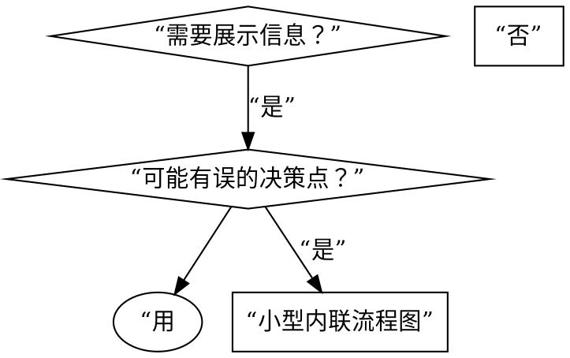

# 编写技能

## 概述

**编写技能就是将测试驱动开发应用于流程文档。**

**个人技能存放在 agent 专属目录（Claude Code 用 `~/.claude/skills`，Codex 用 `~/.agents/skills/`）**

你编写测试用例（带 subagent 的压力场景）、观察它们失败（基线行为）、编写技能（文档）、观察测试通过（agent 遵从）、然后重构（封堵漏洞）。

**核心原则：** 如果你没看过 agent 在无技能时失败，你就不知道技能是否教会了正确的东西。

**必需背景：** 使用此技能前你 MUST 理解 superpowers:test-driven-development。该技能定义了基本的 RED-GREEN-REFACTOR 循环。本技能将 TDD 适配到文档领域。

**官方指导：** Anthropic 官方的技能编写最佳实践见 anthropic-best-practices.md。本文档提供补充的模式和指南，与以 TDD 为核心的方法相辅相成。

## 什么是技能？

**技能** 是经过验证的技术、模式或工具的参考指南。技能帮助未来的 Claude 实例发现并应用有效的方法。

**技能是：** 可复用的技术、模式、工具、参考指南

**技能不是：** 关于你如何一次性解决某个问题的叙述

## 技能的 TDD 映射

| TDD 概念 | 技能创建 |
|---------|---------|
| **测试用例** | 带 subagent 的压力场景 |
| **生产代码** | 技能文档（SKILL.md） |
| **测试失败（RED）** | agent 在无技能时违反规则（基线） |
| **测试通过（GREEN）** | agent 在有技能时遵从 |
| **重构** | 封堵漏洞同时保持遵从 |
| **先写测试** | 在编写技能前跑基线场景 |
| **观察失败** | 逐字记录 agent 使用的合理化借口 |
| **最简代码** | 编写针对那些具体违规的技能 |
| **观察通过** | 验证 agent 现在遵从 |
| **重构循环** | 发现新合理化借口 → 封堵 → 重新验证 |

整个技能创建过程遵循 RED-GREEN-REFACTOR。

## 何时创建技能

**创建时机：**
- 技术对你来说并非直观易懂
- 你会跨项目再次参考它
- 模式适用范围广（非项目专属）
- 他人会受益

**不要创建：**
- 一次性解决方案
- 其他地方已有完善文档的标准实践
- 项目专属约定（放入 CLAUDE.md）
- 机械性约束（如果可用正则/验证强制实施，就自动化它——把文档留给需要判断的情况）

## 技能类型

### 技术型
有步骤可循的具体方法（condition-based-waiting、root-cause-tracing）

### 模式型
思考问题的方式（flatten-with-flags、test-invariants）

### 参考型
API 文档、语法指南、工具文档（office docs）

## 目录结构

```
skills/
  skill-name/
    SKILL.md              # 主参考（必需）
    supporting-file.*     # 仅必要时
```

**扁平的命名空间**——所有技能在一个可搜索的命名空间中

**分离到单独文件：**
1. **重量级参考**（100 行以上）——API 文档、完整语法
2. **可复用工具**——脚本、实用工具、模板

**保持内联：**
- 原则和概念
- 代码模式（50 行以内）
- 其他所有内容

## SKILL.md 结构

**前置元数据（YAML）：**
- 两个必需字段：`name` 和 `description`（所有支持字段见 [agentskills.io/specification](https://agentskills.io/specification)）
- 总计最多 1024 字符
- `name`：仅使用字母、数字和连字符（无括号、特殊字符）
- `description`：第三人称，仅描述何时使用（而非它做什么）
  - 以 “Use when...” 开头以聚焦触发条件
  - 包含具体症状、情境和上下文
  - **绝不总结技能的过程或工作流**（见 CSO 章节了解原因）
  - 如可能，保持在 500 字符以内

```markdown
---
name: Skill-Name-With-Hyphens
description: 在以下情况使用：[具体触发条件和症状]
---

# 技能名称

## 概述
这是什么？核心原则一两句话。

## 何时使用
[如果决策不明显可加小型内联流程图]

带有症状和用例的列表
何时不使用

## 核心模式（针对技术/模式型）
改进前后的代码对比

## 快速参考
便于扫描常用操作的表格或列表

## 实现
简单模式用内联代码
重量级参考或可复用工具用文件链接

## 常见错误
什么会出错 + 如何修复

## 实际效果（可选）
具体结果
```

## Claude 搜索优化（CSO）

**对发现性至关重要：** 未来的 Claude 通过读取 description 决定是否加载你的技能。

**核心原则：描述 = 何时使用，而非技能做什么。**
- 以 “Use when...” 开头，聚焦触发条件与症状
- **绝不总结技能的过程或工作流**——测试发现，描述若总结工作流，Claude 会只跟随描述而跳过技能主体
- 第三人称、含具体症状、与技术无关（除非技能本身技术特定）

最简好坏对照：

```yaml
# ❌ 坏：总结了工作流——Claude 可能跟随它而非阅读技能
description: 在执行计划时使用——按任务分发 subagent，任务间进行代码审查
# ✅ 好：仅触发条件，无工作流总结
description: 在当前会话中执行含独立任务的实施计划时使用
```

关键词覆盖、描述性命名、Token 效率目标、交叉引用其他技能的完整规则与好坏示例见 **claude-search-optimization.md**。

## 流程图使用



**仅在这些场景使用流程图：**
- 非显而易见的决策点
- 你可能过早停止的流程循环
- “何时用 A vs B” 的决策

**绝不在以下场景使用流程图：**
- 参考材料 → 表格、列表
- 代码示例 → Markdown 代码块
- 线性指令 → 编号列表
- 无语义含义的标签（step1、helper2）

Graphviz 样式规则见 @graphviz-conventions.dot。

**为人类伙伴可视化：** 使用此目录中的 `render-graphs.js` 将技能的流程图渲染为 SVG：
```bash
./render-graphs.js ../some-skill           # 分别渲染每个图示
./render-graphs.js ../some-skill --combine # 将所有图示合并为一张 SVG
```

## 代码示例

**一个优秀的示例胜过多个平庸的示例**

选择最相关的语言：
- 测试技术 → TypeScript/JavaScript
- 系统调试 → Shell/Python
- 数据处理 → Python

**好的示例：**
- 完整且可运行
- 有良好注释，解释为什么
- 来自真实场景
- 清晰展示模式
- 可随时适配（非通用模板）

**不要：**
- 用 5 种以上语言实现
- 创建填空模板
- 编写牵强的示例

你很擅长移植——一个好的示例就足够了。

## 文件组织

### 自包含技能
```
defense-in-depth/
  SKILL.md    # 所有内容内联
```
适用：所有内容能容纳，无需重量级参考

### 带可复用工具的技能
```
condition-based-waiting/
  SKILL.md    # 概述 + 模式
  example.ts  # 可供适配的工作辅助代码
```
适用：工具是可复用代码，而非仅仅叙述

### 带重量级参考的技能
```
pptx/
  SKILL.md       # 概述 + 工作流
  pptxgenjs.md   # 600 行 API 参考
  ooxml.md       # 500 行 XML 结构
  scripts/       # 可执行工具
```
适用：参考材料太大，不便于内联

## 铁律（与 TDD 相同）

```
无失败测试在先，则无技能
```

这适用于新技能和对现有技能的编辑。

在测试之前编写了技能？删除它。重新开始。
未测试就编辑技能？同样的违规。

**无例外：**
- 不适用于“简单添加”
- 不适用于“只是加个章节”
- 不适用于“文档更新”
- 不要将未经测试的变更保留为“参考”
- 不要在运行测试时“适配”
- 删除就是删除

**必需背景：** superpowers:test-driven-development 技能解释了为何重要。相同原则适用于文档。

## 测试所有技能类型

不同技能类型需要不同的测试方法：

### 纪律执行型技能（规则/要求）

**示例：** TDD、完成前验证、编码前设计

**测试方法：**
- 学术性问题：他们理解规则吗？
- 压力场景：他们在压力下遵从吗？
- 多重压力组合：时间 + 沉没成本 + 疲惫
- 识别合理化借口并增加明确对位

**成功标准：** agent 在最大压力下遵守规则

### 技术型技能（操作指南）

**示例：** condition-based-waiting、root-cause-tracing、defensive-programming

**测试方法：**
- 应用场景：他们能正确应用技术吗？
- 变体场景：他们能处理边界情况吗？
- 信息缺失测试：指令有缺口吗？

**成功标准：** agent 成功将技术应用于新场景

### 模式型技能（心智模型）

**示例：** reducing-complexity、information-hiding concepts

**测试方法：**
- 识别场景：他们能识别模式何时适用吗？
- 应用场景：他们能使用心智模型吗？
- 反例：他们知道何时不适用吗？

**成功标准：** agent 正确识别何时/如何应用模式

### 参考型技能（文档/API）

**示例：** API 文档、命令参考、库指南

**测试方法：**
- 检索场景：他们能找到正确的信息吗？
- 应用场景：他们能正确使用找到的信息吗？
- 缺口测试：常用场景是否覆盖？

**成功标准：** agent 找到并正确应用参考信息

## 对抗合理化

执行纪律的技能需要抵抗合理化——agent 很聪明，在压力下会找漏洞。

**核心手法：**
- **明确封堵每个具体变通方法**（不只说规则，要禁止具体的“参考保留”“适配”等借口）
- 建立“借口 → 事实”**合理化表**
- 创建**红旗清单**供 agent 自检（如“这不一样，因为……”）
- 在 description 中加入**违规症状**
- **违反规则的字面含义就是在违反规则的精神**——切断“我遵循精神”的整类借口

跳过测试的借口对照表、完整封堵手法、合理化表与红旗清单模板见 **anti-rationalization.md**（说服技术研究基础见 persuasion-principles.md）。

## 技能的 RED-GREEN-REFACTOR

遵循 TDD 循环：

### RED：编写失败测试（基线）

用 subagent 运行压力场景，不带技能。记录精确行为：
- 他们做了哪些选择？
- 他们用了什么合理化借口（逐字）？
- 哪些压力触发了违规？

这就是“观察测试失败”——你必须在编写技能前看到 agent 的自然行为。

### GREEN：编写最简技能

编写针对那些具体合理化借口的技能。不要为假设场景添加额外内容。

用技能运行相同场景。agent 现在应遵从。

### REFACTOR：封堵漏洞

agent 发现了新的合理化借口？增加明确对位。重新测试直到防弹。

**测试方法：** 完整测试方法论见 @testing-skills-with-subagents.md：
- 如何编写压力场景
- 压力类型（时间、沉没成本、权威、疲惫）
- 系统化封堵漏洞
- 元测试技巧

## 反模式

### ❌ 叙述性示例
“在 2025-10-03 的会话中，我们发现空的 projectDir 导致……”
**为什么不好：** 过于具体，不可复用

### ❌ 多语言稀释
example-js.js、example-py.py、example-go.go
**为什么不好：** 质量平庸，维护负担

### ❌ 代码写入流程图
```dot
step1 [label="import fs"];
step2 [label="read file"];
```
**为什么不好：** 无法复制粘贴，难以阅读

### ❌ 通用标签
helper1、helper2、step3、pattern4
**为什么不好：** 标签应有语义含义

## 停止：进入下一个技能前

**写完任何技能后，你 MUST 停下来完成部署流程。**

**不要：**
- 批量创建多个技能而不逐个测试
- 在当前技能未被验证前进入下一个
- 因为“批量更高效”而跳过测试

**下面的部署清单是每个技能的强制步骤。**

部署未经测试的技能 = 部署未经测试的代码。这是违反质量标准的。

## 技能创建清单（TDD 适配版）

**重要：使用 TodoWrite 为下方每个清单项创建待办事项。**

**RED 阶段——编写失败测试：**
- [ ] 创建压力场景（纪律型技能用 3 种以上压力组合）
- [ ] 无技能运行场景——逐字记录基线行为
- [ ] 识别合理化/失败中的模式

**GREEN 阶段——编写最简技能：**
- [ ] 名称仅使用字母、数字、连字符（无括号/特殊字符）
- [ ] YAML 前置元数据含必需的 `name` 和 `description` 字段（最多 1024 字符；见 [规范](https://agentskills.io/specification)）
- [ ] description 以 “Use when...” 开头并包含具体触发器/症状
- [ ] description 以第三人称编写
- [ ] 全文含搜索关键词（错误、症状、工具）
- [ ] 清晰的概述含核心原则
- [ ] 解决 RED 阶段识别的具体基线失败
- [ ] 代码内联或链接到单独文件
- [ ] 一个优秀的示例（非多语言）
- [ ] 用技能运行场景——验证 agent 现在遵从

**REFACTOR 阶段——封堵漏洞：**
- [ ] 从测试中识别新的合理化借口
- [ ] 增加明确对位（如为纪律型技能）
- [ ] 从所有测试迭代建立合理化表
- [ ] 创建红旗清单
- [ ] 重新测试直到防弹

**质量检查：**
- [ ] 仅在决策不明显时使用小型流程图
- [ ] 快速参考表
- [ ] 常见错误章节
- [ ] 无叙述性故事
- [ ] 支持文件仅限于工具或重量级参考

**部署：**
- [ ] 将技能提交到 git 并推送到你的 fork（如已配置）
- [ ] 考虑通过 PR 贡献回来（如果广泛有用）

## 发现工作流

未来的 Claude 如何找到你的技能：

1. **遇到问题**（“测试不稳定”）
2. **找到技能**（description 匹配）
3. **扫描概述**（这相关吗？）
4. **阅读模式**（快速参考表）
5. **加载示例**（仅在实现时）

**为此流程优化**——尽早且频繁地放置可搜索术语。

## 底线

**创建技能就是将 TDD 应用于流程文档。**

相同的铁律：无失败测试在先，则无技能。
相同的循环：RED（基线）→ GREEN（编写技能）→ REFACTOR（封堵漏洞）。
相同的收益：更高质量、更少意外、防弹结果。

如果你遵循代码的 TDD，也要遵循技能的 TDD。这是相同的纪律，应用于文档。
